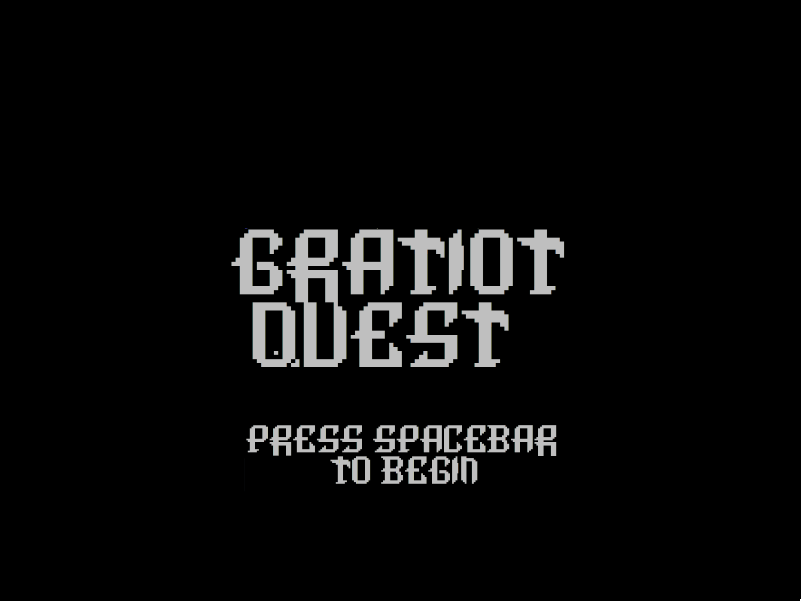
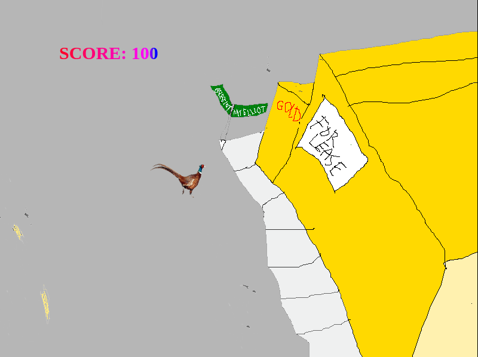

# gratiot quest

A websocket multiplayer canvas game. You are a pheasant and you run around and
eat catfood. It is multi-player and there is a chatroom

## Run

```
cd app
yarn
yarn start
```

- v1 of the app used socket.io and an ec2 instance
- v2 of the game uses websockets with serverless AWS services https://docs.aws.amazon.com/apigateway/latest/developerguide/apigateway-websocket-api.html

## Screenshots



